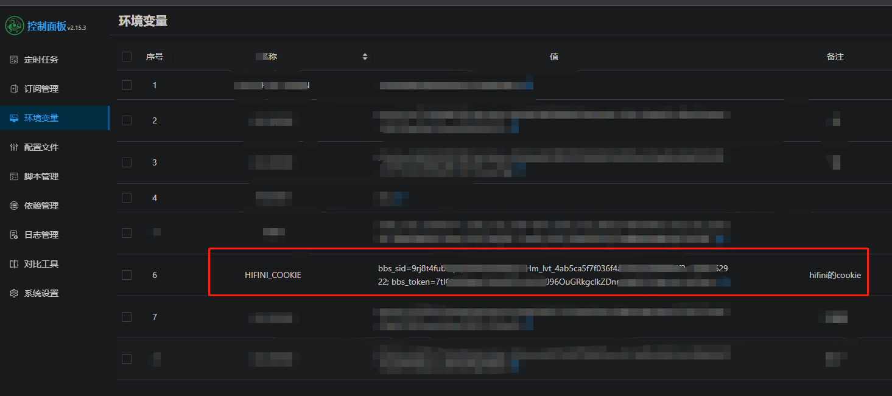

# hifini_sign_in
hifini - 音乐磁场 青龙自动签到脚本

**注：`hifini.com` 已经无法访问，请使用`hifini.net`注册**

## 使用

添加python依赖
```
requests
```

导入配置

```shell
ql repo https://github.com/Lochinor/hifini_sign_in.git "hifini.py"
```

国内机器如下：

```shell
ql repo https://ghproxy.fangkuai.fun/https://github.com/Lochinor/hifini_sign_in.git "hifini.py"
```

单用户模式
青龙面板新增环境变量: `HIFINI_COOKIE`




值应该类似如下: 

```
bbs_sid=9rj8t4fublupqxxxxxxxx;bbs_token=7txxxxxxxx;
```

多用户模式（如果两个都配置了，优先使用此模式）
青龙面板新增环境变量 `HIFINI_JSON`
可以使用工具压缩成一行
```json
[
    {
        "username": "user1",
        "cookie": "bbs_sid=9rj8t4fublupqxxxxxxxx;bbs_token=7txxxxxxxx;"
    },
    {
        "username": "user2",
        "cookie": "bbs_sid=9rj8t4fublupqxxxxxxxx;bbs_token=7txxxxxxxx;"
    }
]
```

#### 原仓库地址
```
https://github.com/fengwenhua/hifini_sign_in
```

## 说明
1. 此脚本是用于签到 `https://www.hifini.net` `https://hifini.net`
2. 支持多用户模式
3. 注意`json`配置的文件格式：最后一个用户后面没有`,`
4. **`sendNotify` 已经不使用了，默认使用全局的通知配置**